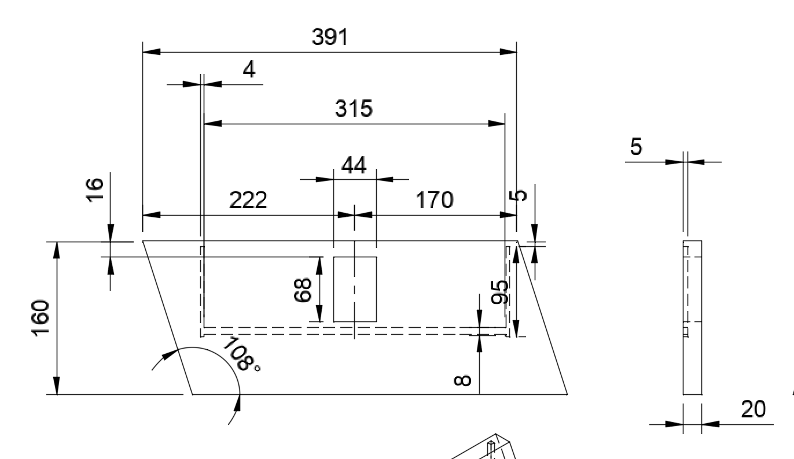
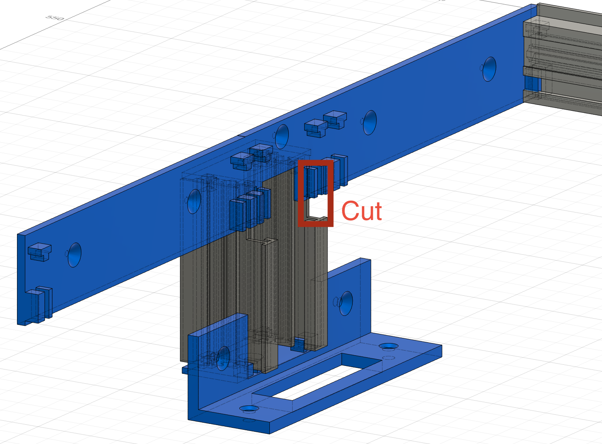

# Eurorack 84HP 7U

Some disclaimer, everything was done by hand. 
Size may differ somewhat. 
You may need to measure things and cut items to slightly different size to make it work.
Sizes are metric in milimeters.

I've first made one variant with some cheap MDF. I recommend you to also first build with cheap materials.
Pictures are only of the 2nd Variant (since thats the only thing I made).
Reason I've added a 1st variant is that not everyone would probably like the 12HP rails on the side.

# Variant 1

This variant doesn't have the side panels.

## BOM

- Powersource
- 6x 84HP Rails
- 6x 84HP Threaded strip M3 
- 2x Metal plate 445mm x 100mm 3mm thick
- 1x Plywood floorpanel 445mm x 314mm, 6 mm thick. (thinner is also ok. I took 8mm for the routed hole, if you take thinner, also adjust the routed hole size.)
- 2x Wooden panel (20mm thick, 160mm tall (bit taller is better for stability), 500mm deep)
- Optional rubber strip for stability 
  
Make sure the wood is not too light. 

## Tools
- Saw (for the wood)
- 3D printer
- Small metal cutting saw
- Sharp knife
- Small drill

for the best look also : 
- CNC router 
- Chisels

## Build

### Brackets
For the brackets you need to have a bed of minimum 3110mm wide. If thats not possible you could deside to split
the top bracket in 2 parts.

Files can be found here : [files](printables/variant1)
You need 2 top brackets (without the side panel)

### Side panels
For the best look you'll need to cnc holes on the inside for the floor panel and metal size to fit in.
If you don't have a cnc, you could simply add some L shaped brackets inside and screw them. Of course for strength and stability it's better to cnc some holes.

See drawing for the dimensions

After routing the holes on the inside, cut the angled sides. Double check if the orientation is right.

### Construct the brackets

Now put the rails into the top bracket like so {TODO}
Don't forget to put the threaded strip in. You need to cut the rails slightly to make it fit due to the pins going into the rails. Be careful not to bend or damage the strip too much. 

Depending on the orientation of the print you may need to cut some of the top _|_ shaped knob at the top. 
Make sure it's not too loose but also not too tight. It may brake if you put too much force on it.

### Floor panels

Now put the brackets between the 2 side panels and check the size of the floorpanel. Cut the panel to the correct size (or route the holes deeper).
If you have a power source with a seperate plug, and you want it to be on the backside, find some good placement 
for your plug/power source and cut holes if needed. If you have an external plug, it should be placed on the bottom for stability.

For additional stability I've added L shaped brackets and connected them to the floorboard and side panels

{TODO} picture

### Metal top and bottom panels

Same as with the floor panels, measure what size you need. I've used metal boards of 100 mm tall, {TODO wide}.
Then cut small corners to make them fit in the holes :

{TODO picture}

### Putting it together

Now this can be tricky. I've placed the side panel flat on the table, put the bracket vertically on the side panel.
Then pre-drill small holes in the wood where the drill holes are.
Take away the bracket, and carefully drill the holes (not through!! just for a bit).
Now put the bracket vertically again and and use some screws to attach them to the side panel.

Put the metal plate and floorpanel in the routed holes of the side panel. 

Now carefully put on the other sidepanel on top. You may need some help from a second person to hold everything in place.

Drill the top sidepanel in as well.

{TODO} drawing

### Optional rubber strip

If you want to, for more stability, you can add a rubber strip to the bottom. like so:

{TODO picture}

# Variant 2
This variant also has the 12 HP side panels. It's a more complicated build.
It's very similar to the first variant. But here you need to route a hole in the middle of the 
side panel for the 12 HP side rails. 
  

## BOM

- Powersource
- 6x 84HP rails
- 4x 12HP rails (for the side panels, variant 2)
- 6x 84HP Threaded strip M3 
- 4x 12HP Threaded strip m3 
- 2x Metal plate 445mm x 100mm 3mm thick
- 1x Plywood floorpanel 445mm x 314mm, 6 mm thick. (thinner is also ok. I took 8mm for the routed hole, if you take thinner, also adjust the routed hole size.)
- 2x Wooden panel (20mm thick, 160mm tall (bit taller is better for stability), 500mm deep)
- Optional rubber strip for stability 

  
Make sure the wood is not too light. 

## Tools
- Saw (for the wood)
- 3D Printer
- Small metal cutting saw
- CNC router 
- Chisels
- Sharp knife
- Small drill

## Build

### Brackets

This part is similar to variant 1. Except for the brackets.
Print these : 

[files](printables/variant2)

### Side panels

Same as variant one. 
Before you cut the angled sides, make the square hole in the middle.
It's easier to do it before you cut the angled sides if you want guide your router.

The brackets are made for 20mm thickness. If it's slightly more it's still fine. Make sure it's not too thin. The brackets will expand and this is the minimum size that worked.
30 mm will also do but then you'll have to modify the brackets to be deeper.

### Putting the brackets together

Same as for variant 1.
But now you also need to make the 12HP side brackets. 

Easiest is to first construct the top brackets.
Then you'll need to cut part of the 12HP rails (top, on the inside) so they fit in the corner, 
like so : 

Don't forget to also put 12HP threaded rails in there. If you forget you have to take the whole thing apart in the end (.. this happened to me).
The construction is not strong, be carefuly to not break the 12HP brackets.
When you finally put it together it will be strong enough.

### Floor panels

Same as variant 1

### Metal top and bottom panels

Same as variant 1

### Putting it together

This is very similar to variant 1. It's not an easy task. You may need a second person to hold the panels together.

I did find the easiest way to put one side flat to the table and build vertically. This way gravity makes sure
things stay in place. If you try to put it together horizontally it's more difficult. 

Just lower the whole rails construction with 12HP bracket into the hole. 
Follow the same procedure as with variant 1.

### Optional rubber strip

Same as for variant 1

# Ethernet 12HP 1U side panel

# BOM

- 2 shielded ethernet cables {todo size}. You can typically recognize shielded by the metal bracket on the RJ45 connector. There are some fakes out there. Be sure it's shielded.
- Optional 2 ethernet cables to connect to another case (also shielded)
- {TODO} ethernet female to female
  
## Tools
- 3d Printer
- metal cutting saw
- strong glue

# Build

First print the 2 parts needed :

[files](printables/ethernet)

Now this is a bit tricky since 1U is very narrow.
Put the female ethernet brackets into the holders.
I had to cut any part that sticks out of the bracket to make it fit.
I used a small metal cutting saw to make it slimmer.
for some extra support you can clue the ethernet female to female ports to the 3d print

push the ethernet ports into the 12HP rack and secure it with some knurlies or screws onto the threaded rail.
Now put the small bar left onto the other side.

I've used a Doepfer A-180-9 Multicore in my case for this. It's good value and small size. 
Plum Audio has some nice modules as well. You could also use HMDI instead of RJ45. 
I may later add a pcb design + BOM for your own passive routing module. The downside of the Doepfer is that the ethernet port is in the front, not the back.

What is left is routing the ethernet cables to your multicore solution. Plug the shielded cables in, on the inside and route them to your multicore solution.
